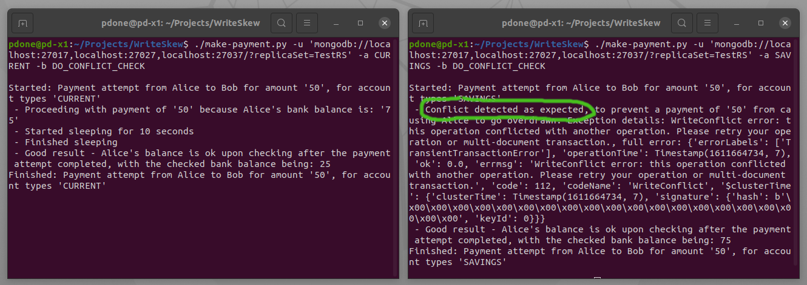
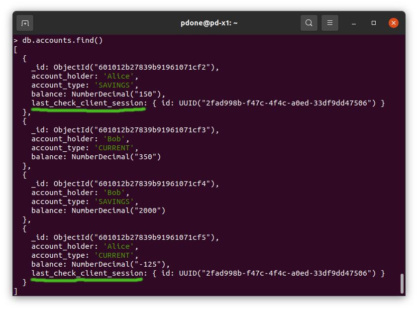

# Introduction

A Python application for simulating a write skew anomaly with MongoDB and the __snapshot isolation__ level it provides for transactions. This type of anomaly is to be expected and is the same as occurs in any database which provides [snapshot isolation](https://en.wikipedia.org/wiki/Snapshot_isolation), such as _Oracle_ for example. This application also shows how to defend against this type of anomaly by _promoting_ a _causal_ read-only query operation to, instead, be an update operation, as described in a [blog post by Renato Riccio](https://www.mongodb.com/blog/post/how-to-select--for-update-inside-mongodb-transactions). This approach is similar to an application explicitly having to employ Oracle's __SELECT FOR UPDATE__ command, when using an Oracle database, to avoid a write skew from occurring.

The application simulates the "2 bank accounts" write skew scenario outlined in the [Snapshot Isolation](https://en.wikipedia.org/wiki/Snapshot_isolation#Definition) Wikipedia page, where two separate transactions each update separate bank accounts, but each transaction bases the update it executes on values obtained from prior overlapping reads. In this scenario, the system is trying to ensure a person never goes overdrawn across the sum of their different bank accounts. However, due to the write skew anomaly occurring with _snapshot isolation_, the resulting race conditions mean that avoiding being overdrawn cannot be guaranteed, without additional logic being incorporated in the application.

For this demonstration application, to reproduce the write skew situation, a simple _bank accounts_ MongoDB database collection will be used which contains four account records: 2 for Alice (a current account + a savings account), and 2 for Bob (a current account + a savings account), as shown below:

```js
[
  {
    _id: ObjectId('6756c8941945476cad44b134'),
    account_holder: 'Alice',
    account_type: 'CURRENT',
    balance: Decimal128('10')
  },
  {
    _id: ObjectId('6756c8941945476cad44b135'),
    account_holder: 'Bob',
    account_type: 'CURRENT',
    balance: Decimal128('300')
  },
  {
    _id: ObjectId('6756c8941945476cad44b136'),
    account_holder: 'Bob',
    account_type: 'SAVINGS',
    balance: Decimal128('2000')
  },
  {
    _id: ObjectId('6756c8941945476cad44b137'),
    account_holder: 'Alice',
    account_type: 'SAVINGS',
    balance: Decimal128('75')
  }
]
```

One instance of the application will be run to attempt to move an amount of 50 from Alice's current account to Bob's current account and a separate instance of the application will be run to move an amount of 50 from Alice's savings account to Bob's savings account, concurrently. When totalling the balance of both of Alice's account (current + savings), Alice only has enough funds to support one of these two payments, to avoid being net overdrawn.

The demonstration first shows how, with a naive approach, Alice can inadvertently become overdrawn when both payments are simultaneously attempted, even though [multi-record ACID transactions](https://docs.mongodb.com/manual/core/transactions/) are being employed. An artificial pause of 10 seconds is introduced between the read operations and the update operations of each application's transaction, to enable the potential race condition to be more easily and reliably reproduced. It is then shown how this overdraft possibility can be avoided by incorporating further logic in the application to allow the conflict to be detected and hence prevent the write skew from occurring. This is achieved in the part of the code which originally reads the balances of each of Alice's accounts, to instead perform a simultaneous read with _dummy_ update of each account being queried (by using `find_one_and_update()` & `$set`in the application's code). This effectively ties the causal dependency of the later update operations to the initial '_read_' operations, together in the same transaction snapshot, thus allowing any conflict between two competing transaction's '_reads_' to be automatically detected.


# Prerequisites

* A [MongoDB Replica Set](https://docs.mongodb.com/manual/tutorial/deploy-replica-set/) is running and network accessible, using MongoDB version 4.4 or greater
* Python version 3, the latest MongoDB Python Driver, `pymongo` and the Python DNS library, `dnspython` have all been installed locally
* Two command line terminals/shells have been launched ready to run two different instances of the same Python application, with different arguments, to be used to simulate two concurrent transactions


# Simulating The Write Skew Anomaly

1. Run the provided _bash_ script to initialise the database with 4 bank account records (a current account and a savings account, each for Alice and Bob). For example (change the URL first to match your the location of your MongoDB clustered database):

```bash
./initdb.sh 'mongodb://localhost:27017,localhost:27027,localhost:27037/?replicaSet=TestRS'
```

2. Using the [Mongo Shell](https://www.mongodb.com/docs/mongodb-shell/) or [MongoDB Compass](https://www.mongodb.com/products/compass) inspect the contents of the new `bank` database. For example (change the URL first):

```bash
mongosh 'mongodb://localhost:27017,localhost:27027,localhost:27037/?replicaSet=TestRS'
use bank
show collections
db.accounts.find()
exit
```

3. Setup Python Virtual Environment and install dependencies

```bash
python3 -m venv .venv
source .venv/bin/activate
pip3 install -r requirements.txts
```

4. In terminal 1, launch the project's Python application with an argument flag `CURRENT` specified to indicate that a payment of 50 should be made, debiting Alice's __current account__ and crediting Bob's current account. For example (change the URL first):

```bash
./make-payment.py -u 'mongodb://localhost:27017,localhost:27027,localhost:27037/?replicaSet=TestRS' -a CURRENT
```

5. Very quickly (__within 10 seconds of executing the previous step__), in terminal 2, launch the project's Python application but this time with the flag `SAVINGS` to indicate that a payment of 50 should be made, debiting Alice's __savings account__ and crediting Bob's savings account. For example (change the URL first):

```bash
./make-payment.py -u 'mongodb://localhost:27017,localhost:27027,localhost:27037/?replicaSet=TestRS' -a SAVINGS
```

__EXPECTED RESULT__: Even though each transaction performs a check of Alice's net balance across her current and saving account to see if it is equal or greater than 50 to cover the 50 payment she is making, a problem occurs due to the write skew anomaly. This is because the balance check queries are not being causally tied into to the subsequent bank account updates. After both transactions complete, Alice is unintentionally left overdrawn. The output of running both transactions should be similar to the screenshot shown below, showing the overdrawn error message:

 

&nbsp;Checking the state of the database account records using the Mongo Shell / Compass will also show that in totality, Alice is now overdrawn.


# Avoiding The Write Skew Anomaly

1. Re-run the database initialisation _bash_ script to reset all the bank account data to the original state again. For example (change the URL first):

```bash
./initdb.sh 'mongodb://localhost:27017,localhost:27027,localhost:27037/?replicaSet=TestRS'
```

2. In terminal 1, run the first instance of Python application again, now with an additional argument flag `DO_CONFLICT_CHECK` to indicate that the application should attempt to block any other transactions that are attempting to read the same account records it reads before it executes the update parts of the transaction. For example (change the URL first):

```bash
./make-payment.py -u 'mongodb://localhost:27017,localhost:27027,localhost:27037/?replicaSet=TestRS' -a CURRENT -b DO_CONFLICT_CHECK
```

3. Again, very quickly in terminal 2, run the second instance of the Python application also with the additional flag `DO_CONFLICT_CHECK`. For example (change the URL first):

```bash
./make-payment.py -u 'mongodb://localhost:27017,localhost:27027,localhost:27037/?replicaSet=TestRS' -a SAVINGS -b DO_CONFLICT_CHECK
```

__EXPECTED RESULT__: This time the outcome is that only one of the two Payments is correctly allowed to complete, thus leaving Alice with a net positive balance across her two accounts. The second of the two transactions will be blocked by the first transaction, correctly resulting in a transaction conflict being detected. As a result, the second transaction is rightly rolled back. The output of running both transactions should be similar to the screenshot shown below:

 

&nbsp;Checking the state of the database account records using the Mongo Shell / Compass will show that the desired final state of all four bank accounts has been achieved and neither Alice nor Bob are net overdrawn.

NOTE: When you look at the final contents of the database you may notice that some of records now have an extra field, `last_check_client_session`. This is vestigial having been the new field, with a unique value, set by the application, to essentially convert what would have been a read operation into an update operation (by using `find_one_and_update()` & `$set`in the Python code). This enabled the write conflict to be detected for the two application instances that both had a causal relationship on reading the same data. Having this field appearing in the records does no harm, especially in databases which have flexible schemas like MongoDB, and there should be no detrimental side effects as a result.

 

